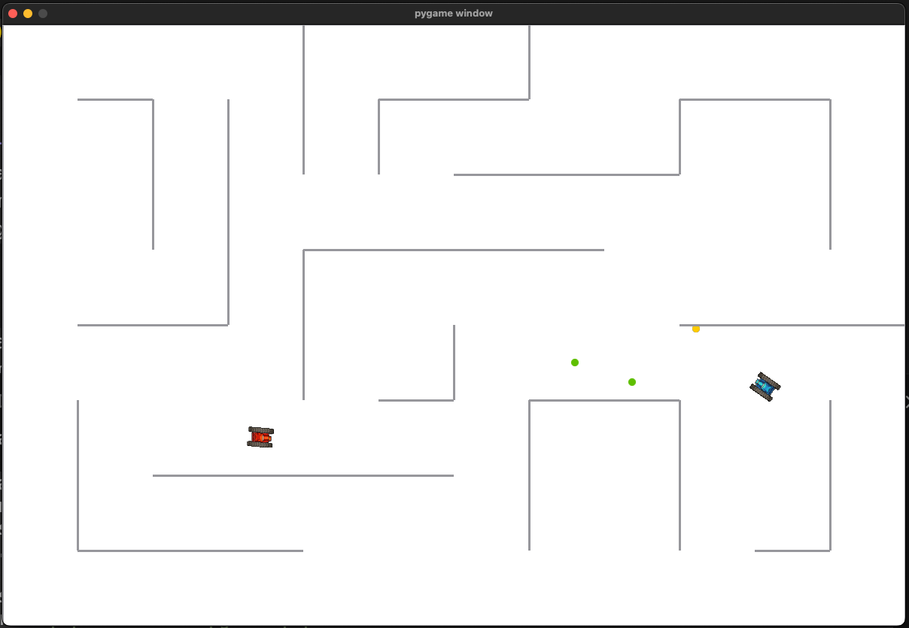
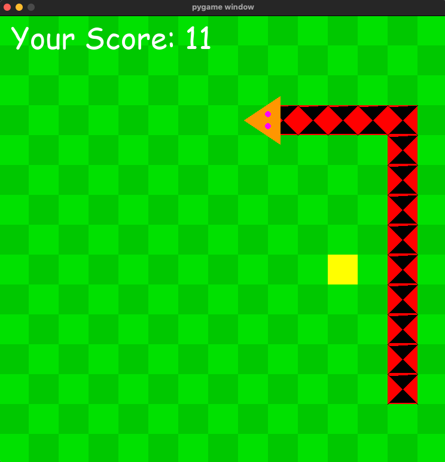
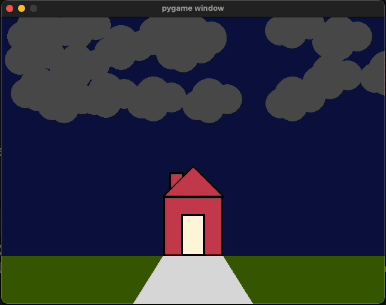

# ICS3U1 Python Projects

This repository contains a collection of Python projects developed for the ICS3U1 course (Introduction to Computer Science, Grade 11). It includes several games and graphical demonstrations using Pygame and standard Python libraries.

## Projects Included

1.  **Text Adventure Game (`adventure/`)**
    * A classic text-based RPG.
    * Players create a character, allocate stats (Strength, Charisma, Intelligence), and manage an inventory (HP, Gold, Weapon, Potions, Map).
    * Navigate different locations: Shop, Dungeon, Castle, Library, Prison.
    * Engage in turn-based combat with enemies (Goblin, Wizard, Dragon).
    * Features a shop for purchasing items and stat upgrades.
    * Includes different scenarios based on player choices and stats.
    * Goal: Defeat the final boss in the Castle.

2.  **Tank Battle Game (`cpt/`)**
    * A 2-player top-down tank combat game built with Pygame.
    * Player 1 controls (Red Tank): WASD for movement, Q to shoot.
    * Player 2 controls (Blue Tank): Arrow keys for movement, Spacebar to shoot.
    * Features include tank rotation, movement, shooting projectiles.
    * Bullets bounce off walls (indicated by color change).
    * Collision detection between tanks, bullets, and walls.
    * Includes explosion animation upon tank destruction.
    * Game over screen with a "Play Again" option.
    
    

3.  **Snake Game (`snake.py`)**
    * The classic Snake game implemented using Pygame.
    * Control the snake using Arrow Keys (Up, Down, Left, Right).
    * Eat the yellow apple to grow longer and increase the score.
    * Avoid hitting the walls or the snake's own body.
    * Features a start menu to select game speed (Slow, Normal, Fast).
    * Displays the current score.
    * Game over screen with an option to restart (Press Space).
    
    

4.  **Landscape Scene (`landscape.py`)**
    * A dynamic graphical scene created with Pygame.
    * Displays a landscape with grass, a road, and a house with a chimney.
    * Features a day-to-night transition where the sky, grass, and cloud colors change over time.
    * Includes randomly generated clouds that move across the sky.
    * Shows occasional lightning effects during the "night" phase.
    
    

## Setup and Installation

1.  **Prerequisites:**
    * Python 3.x installed.
    * Pygame library installed. If not, run:
        ```bash
        pip install pygame
        ```

2.  **Get the Code:**
    * Clone the repository:
        ```bash
        git clone <repository_url>
        ```
    * Or download and extract the ZIP file.

## How to Run

Navigate to the repository's root directory in your terminal before running the following commands:

1.  **Text Adventure Game:**
    ```bash
    cd adventure
    python main.py
    cd ..
    ```

2.  **Tank Battle Game:**
    * Ensure you are in the *root* directory of the project.
    ```bash
    python cpt/main.py
    ```
    *(Note: This script expects to be run from the root directory to correctly locate the `cpt/tankSprite/` assets).*

3.  **Snake Game:**
    ```bash
    python snake.py
    ```

4.  **Landscape Scene:**
    ```bash
    python landscape.py
    ```

